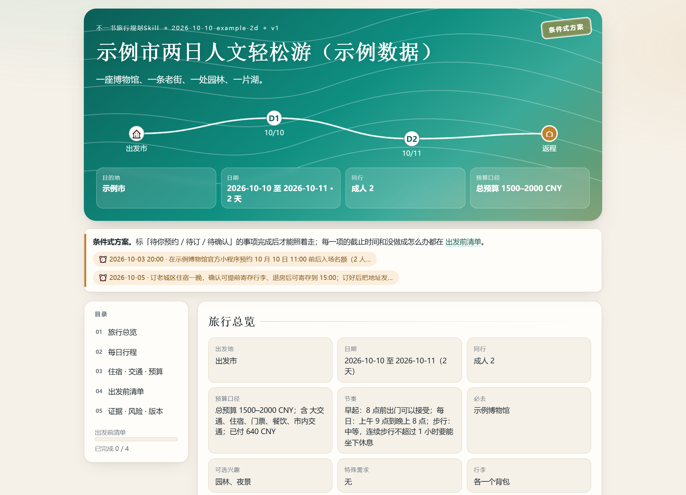

<p align="center">
  
</p>

<h1 align="center">不一书旅行规划</h1>

<p align="center">
  <strong>从旅行想法，到可执行的每日行程。</strong><br>
  选目的地 · 排行程 · 算预算 · 留备用 · 随时调整
</p>

<p align="center">
  <a href="#开始你的旅行">开始使用</a> ·
  <a href="#把攻略带在身边">查看攻略</a> ·
  <a href="docs/USAGE.md">使用指南</a> ·
  <a href="LICENSE">MIT 开源</a>
</p>

---

**旅行规划（bys-travel-plan）** 是一个对话式旅行规划 Skill。告诉 AI 你从哪里出发、准备玩几天、和谁同行、想怎么花这段时间，它会陪你比较目的地、查阅资料、安排每天的路线，最后交付一份完整 Markdown 攻略和一份可离线打开的旅行手账网页。

周末想出去走走，长假想认真安排，或者机票酒店已经订好——都可以从你现在这一步开始。

## 一次旅行，照顾到每个细节

### 🧭 还没想好去哪，先找到适合你的方向

按出发地、时间、预算和兴趣比较多个目的地。把往返交通、实际可玩时间和各自的旅行体验放在一起看，让你知道为什么选这里。

### 🗓️ 每一天都有顺序，也有留白

把景点、餐饮、交通和休息排进同一条时间线。按片区串联路线，照顾首末日的赶车节奏；已经订好的车票、酒店和必去项目，会成为整份计划的起点。

### 👨‍👩‍👧 同行的人，决定旅行的节奏

带孩子、陪长辈、两个人慢慢逛，各有合适的安排。把连续步行、排队、坐休、午休和住宿基点一起考虑，为真正同行的人规划每一天。

### 💰 钱花在哪里，出发前心里有数

区分人均与全队预算，拆开交通、住宿、门票、餐饮和机动费用。已付金额和待付费用分别呈现，比较方案时，也能看清每次取舍带来的变化。

### 🔎 资料、预约和行动，连成一份计划

围绕出行日期整理开放时间、预约入口和交通资料，保留来源与核查时间。把需要提前完成的事变成清单；也可按你的选择接入 TikHub，补充小红书笔记与评论中的旅行体验。

### 🔄 天气变了，想法变了，计划跟着调整

为雨天和预约变化准备替代路线。你可以只改某一天、推迟出发或换个住宿区域；相关交通、预算与清单会一起更新，旧版本也能找回来。

## 把攻略带在身边

**一份完整文字攻略，一份随手可看的旅行手账。**



| 你拿到的内容 | 怎么用 |
| --- | --- |
| **完整 Markdown 攻略** | 阅读、编辑、整理进自己的笔记，和同行的人一起讨论 |
| **单文件 HTML 手账** | 下载后双击打开；按天查看路线、预算和出发前清单，支持离线阅读与打印 |
| **行程版本存档** | 保存每次调整，比较新旧安排，继续上次的旅行计划 |
| **图片行程卡（可选）** | 在支持生图的宿主中，确认攻略后生成总览卡、每日卡和清单卡 |

Markdown 与网页来自同一份行程。修改一次，两份同步。

[阅读文字攻略示例](docs/examples/outputs/2026-10-10-example-2d_v1.md) · [下载 HTML 手账示例](docs/examples/outputs/2026-10-10-example-2d_v1.html)

<details>
<summary>查看手机上的每日行程</summary>

<p align="center"></p>

</details>

## 开始你的旅行

### 1. 把 Skill 放进你的 AI 助手

下载本仓库，将文件夹命名为 `bys-travel-plan`，放入所用 AI 工具的 Skill 目录，保留里面的 `SKILL.md`、`references/`、`scripts/` 和 `assets/`。

也可以把仓库放在当前工作区，直接对支持文件读取的 AI 助手说：

```text
请读取 bys-travel-plan/SKILL.md，按照“不一书旅行规划”的流程帮我规划旅行。
```

使用脚本自动生成攻略时，准备 Python 3.10+ 即可，脚本使用 Python 标准库。详细操作见[使用指南](docs/USAGE.md)。

### 2. 用你平时说话的方式，告诉它想怎么旅行

**还没决定目的地**

```text
下个月想找个周末出去走走，从上海出发，两个人，总预算2500元。
喜欢老街、人文和小吃，不开车，想轻松一点。先帮我比较三个方向。
```

**目的地和预订已经确定**

```text
我想去南京玩四天三晚，带一位长辈和一个8岁的孩子。
车票和新街口的酒店都订好了，想去南京博物院，每天9点以后出门。
请帮我排好每天的路线、休息和吃饭，做成完整攻略和离线网页。
```

**继续调整已有攻略**

```text
把第二天上午改得轻松些，9点退房后找地方休息。
午餐和返程车票保持原样，更新两份攻略，并保留旧版本。
```

### 3. 看过攻略，一起把它调成你的旅行

“这一天太满了”“把下午留给咖啡馆”“酒店换到了另一个区”——直接说出想改的地方。你确认后，还可以继续制作图片行程卡，或者在出发前重新核对整份计划。

## 不一书，让想法落到每天

我们关心一份攻略最终怎么被使用：早上从哪里出发，中途在哪里歇脚，到了当地看什么，雨天怎么换，最后怎样从容返程。

**有顺序，也有余地；照顾风景，也照顾同行的人。**

本skills改编自[qkgecn93/bys-travel-plan](https://github.com/qkgecn93/bys-travel-plan/)
如果你喜欢这份 Skill，欢迎 Star、分享你的使用体验，或一起[参与共建](CONTRIBUTING.md)。

---

<p align="center">
  <strong>不一书 · bys-travel-plan</strong><br>
  用一份好计划，认真对待每一次出发。<br>
  <a href="LICENSE">MIT License</a> · Copyright © 2026 不一书
</p>
